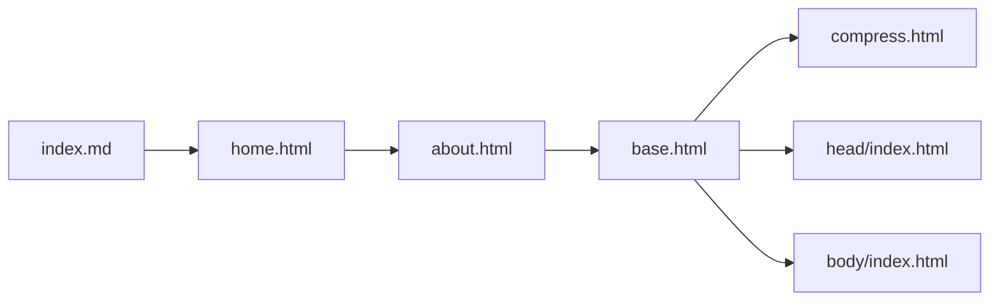
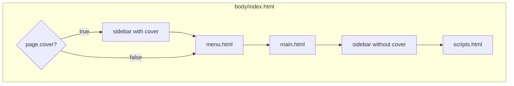

# TsekNet.com

This repo hosts [tseknet.com](https://tseknet.com): a static site built with [Jekyll](https://jekyllrb.com/), the [Hydejack](https://hydejack.com) v9 theme, and [Netlify](https://netlify.com) for build and deploy.

## How the site works

### Layout hierarchy

Every page is rendered through the compress layout (HTML minification), then a content layout. The homepage flows like this:

- **index.md** uses `layout: home` and defines the intro plus `<!--posts-->` placeholder.
- **home.html** extends `about` and expands `<!--posts-->`, `<!--projects-->`, and `<!--posts_list-->` into post/project cards or lists.
- **about.html** extends `base` and wraps content in an article (title, optional `<!--author-->`).
- **base.html** sets accent image/color, then includes `head/index.html` and `body/index.html`.

### Body structure

The main body is built in `_includes/body/index.html`. Sidebar placement depends on `page.cover`:

When `page.cover` is true, the sidebar is included first (full-screen cover). When false, the sidebar is included after main (normal drawer). Scripts run last in both cases.

- **Cover true:** Sidebar is included first with `cover=page.cover`, so the `<hy-drawer>` gets class `cover` and attribute `opened` — full-screen cover; user “slides open” (closes drawer) to see content.
- **Cover false:** Sidebar is included after the menu, so the drawer is in its normal state (content visible by default; sidebar in drawer, visible on desktop, toggled on mobile).

The sidebar (`_includes/body/sidebar.html`) uses the Hydejack `<hy-drawer>`; its content comes from `body/sidebar-sticky.html` (logo, title, tagline, nav from `site.menu`, social links).

### Key files and directories

| Path | Purpose |
|------|--------|
| `_config.yml` | Site title, menu, theme options, Hydejack settings, plugins |
| `_layouts/` | compress, base, default, about, home, page, post, blog, grid, etc. |
| `_includes/body/` | index (body shell), sidebar, menu, main, nav |
| `index.md` | Homepage; `layout: home`, `cover: false` |
| `blog/` | Blog index; posts live in `blog/_posts/` |
| `posts.md` | Post list page (`layout: grid`) |
| `tag.md`, `_featured_tags/` | Tag pages (see `_plugins/tag_generator.rb`) |
| `_data/` | authors, social, strings, variables |

### Build and deploy

- **Local:** `bundle exec jekyll serve`
- **Production build:** `bundle exec jekyll build` (output in `_site/`)

Netlify runs the build and publishes `_site/`; config is in [netlify.toml](netlify.toml) (`JEKYLL_ENV=production`).

## Testing Changes

See the blog post [getting started with Netlify and Jekyll](https://tseknet.com/blog/startblogging).

## Contributing

Pull requests are welcome. For major changes, please open an issue first to discuss what you would like to change.

## License

[MIT](https://choosealicense.com/licenses/mit/)
