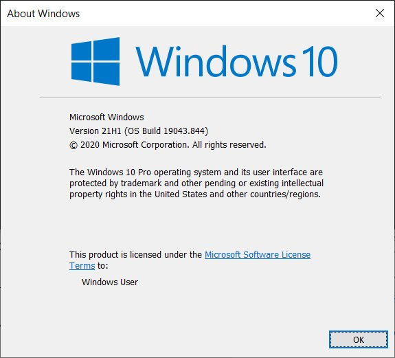
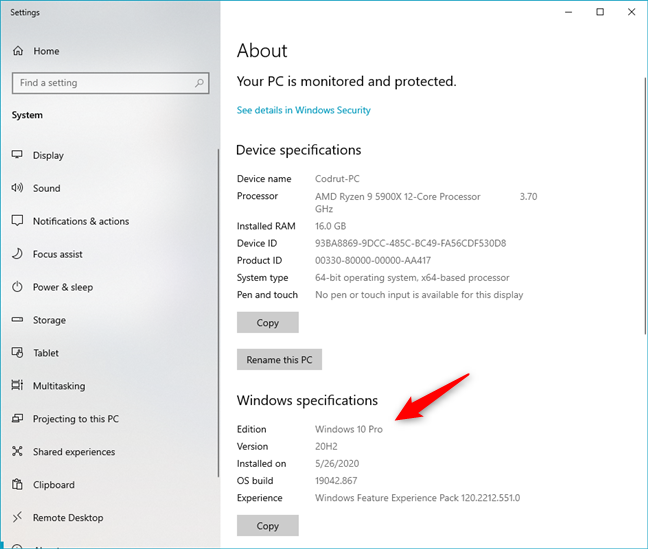

---
layout: post
title: How to Determine Windows Version
image: /assets/img/blog/windowskeyboard.jpg
description: >
  So how does one determine the version of Windows running across an enterprise environment?
tags: [devops, tips, windows, registry]
---

- Table of Contents
{:toc}

Sounds simple, right?
{:.lead}

Microsoft surfaces Windows Version numbers in various locations:

- There are Registry values, which are desperately missing
documentation.
- There are numerous PowerShell Cmdlets, Windows API calls, etc.
- There are also end-user options such as the `winver` command, which pops up a
window that tells the user what their Windows version is.
- And many more...

Helping you make sense of this all is where this post comes in.

There are many tools available to help you determine which version of Windows
your clients are running such as SCCM, PDQ. This post will focus on built-in
methods for determining Windows version.
{:.note}

## Registry

The following Registry values can be used to determine the version of Windows a
system is running:

| Key                                                             | Value          | Data Example | Explanation                           |
| --------------------------------------------------------------- | -------------- | ------------ | ------------------------------------- |
| HKEY_LOCAL_MACHINE\SOFTWARE\Microsoft\Windows NT\CurrentVersion | ReleaseId      | 2009         | Version number integer (as a string). Added in version 1803, Deprecated with 21H1   |
| HKEY_LOCAL_MACHINE\SOFTWARE\Microsoft\Windows NT\CurrentVersion | DisplayVersion | 20H2         | Version codename mixed string. Added in version 1803. |
| HKEY_LOCAL_MACHINE\SOFTWARE\Microsoft\Windows NT\CurrentVersion | CurrentBuild   | 19042        | Version build number, used by winver.exe.                                     |

The values listed in the table above are not officially documented by Microsoft
(see [below](#word-of-warning))
{:.warning}

### Word of Warning

Microsoft has not communicated changes to these Registry values, documented
their official support, or guaranteed against
[breaking changes in the future](https://twitter.com/bytenerd/status/1395072885249564672).
This has lead to a frustrating experience using the Registry keys above, given how inconsistent Microsoft's updates to these keys have historically been. Examples:

- ReleaseID was
  [deprecated](https://twitter.com/bytenerd/status/1395071115072966656) in
  version 21H1. The ReleaseID for 21H1 remains 2009.
- Server 2012R2 doesn't have ReleaseID or DisplayVersion (they weren't added to
  Windows yet)
- Server 2016 has ReleaseID (1607) but no DisplayVersion
- Server 2019 has ReleaseID (1809) no DisplayVersion

## PowerShell

Below are some examples of how you can use PowerShell to determine the version
of Windows your systems are running:

```powershell
# Using the System.Environment Class
[System.Environment]::OSVersion

# Using the Win32_OperatingSystem CIM Class
Get-CimInstance Win32_OperatingSystem

# Using the systeminfo executable
systeminfo.exe /fo csv | ConvertFrom-Csv

# Using the Get-ComputerInfo Cmdlet
# NOTE: OsHardwareAbstractionLayer was deprecated in version 21H1
Get-ComputerInfo | Select WindowsProductName, WindowsVersion, OsHardwareAbstractionLayer
```

## Windows API Call

The only supported (documented) systematic way of determining a Windows version
is through a Windows API call to the
[AnalyticsInfo](https://docs.microsoft.com/en-us/uwp/api/windows.system.profile.analyticsinfo?view=winrt-20348)
class. This can be done via PowerShell as shown below:

<script src="https://gist.github.com/pronichkin/9d5caaf86329c3098e2a9f23d0c07bdd.js"> </script>
Credit: [@pronichkin](https://twitter.com/Pronichkin)
{:.figcaption}

## End-User Options

Microsoft
[documentation](https://support.microsoft.com/en-us/windows/which-version-of-windows-operating-system-am-i-running-628bec99-476a-2c13-5296-9dd081cdd808)
lists a few commands end-users can use to determine which version of Windows
they are running. For example, the `winver` command, or the Windows Settings
menu can be used to determine Windows Version. This is meant to be more end-user
facing for verification, rather than for use to determine system version at
scale. Examples below:




## Why This Matters

Once you've determined the version of Windows your systems are running, you can
use this information to take deterministic actions such as installing Windows
Updates, applying patches, etc. For example:

You can query the `DisplayVersion` registry value ([above](#registry)) to
determine which version of Windows your systems are running. Then, you could set
the Registry values listed below that tell Windows which version the system
should be running. With three registry keys, you've fully controlled which
version of Windows your systems will attempt to upgrade to!

| Key                                                                  | Value                    | Data Example | Explanation                                                                          |
| -------------------------------------------------------------------- | ------------------------ | ------------ | ------------------------------------------------------------------------------------ |
| HKEY_LOCAL_MACHINE\SOFTWARE\Policies\Microsoft\Windows\WindowsUpdate | TargetReleaseVersion     | 1            | Setting this to one enables Feature Upgrades to the TargetReleaseVersionInfo version |
| HKEY_LOCAL_MACHINE\SOFTWARE\Policies\Microsoft\Windows\WindowsUpdate | TargetReleaseVersionInfo | 20H2         | The target version of the system                                                     |
| HKEY_LOCAL_MACHINE\SOFTWARE\Policies\Microsoft\Windows\WindowsUpdate | ProductVersion | Windows 10         | New in Windows 11 - one of "Windows 10" or "Windows 11" |

These registry values can either be set directly, or via [Group Policy](https://www.computerworld.com/article/3564158/microsoft-nixes-update-deferral-settings-but-gives-us-a-targetreleaseversioninfo.html)
{:.note}

## Where to go from here

While it's not necessary to manage which versions of Windows are running on your
fleet, it's likely valuable information to your Enterprise which versions of
Windows are currently running on your fleet. If just for the fact that Windows
regularly ends support for
[versions of Windows](https://docs.microsoft.com/en-us/lifecycle/products/windows-10-enterprise-and-education).

Further, I'll note that the examples above are not meant to be an exhaustive
list of ways to determine Windows version, but rather a reference for myself and
other folks managing a Windows environment. These methods have proven useful to me when troubleshooting issues, setting policy, etc. Hopefully you'll find
them useful as well.

Finally, managing Windows versions has always been a moving target. So I look
forward to making another post about how to manage Windows versions in the
future, once Microsoft has deprecated the existing methods posted above.

Feel free to reach out if you run into any issues, and see related links (below)
for further reading. Hopefully, this post saved you some Googling around trying
to find all this information 🔎

## Related Links

- [Microsoft nixes update deferral settings, but gives us a TargetReleaseVersionInfo](https://www.computerworld.com/article/3564158/microsoft-nixes-update-deferral-settings-but-gives-us-a-targetreleaseversioninfo.html)
- [Windows 10 Version History](https://en.wikipedia.org/wiki/Windows_10_version_history)
- [Windows Server Versions](https://en.wikipedia.org/wiki/List_of_Microsoft_Windows_versions).
