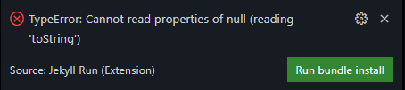

---
layout: post
title: Blog Posts Made Easy With Jekyll and GitHub Codespaces
image: /assets/img/blog/jekyll_codespaces_example.png
description: >
  Make Jekyll blog posts easy with GitHub Codespaces.
tags: [open source, devops, dev, tutorials, github]
---

- Table of Contents
{:toc}

Local web development is so 2020.
{:.lead}

The world has changed a lot since my first blog post about... well... [how I made this blog](startblogging). Naturally, my process for authoring new posts has improved since then. All you'll need to get started is a Visual Studio Codespace and a single Visual Studio Code extension. Let's dive right in and show you how the *sauce is made*.

## GitHub Codespaces

A codespace is your development environment that's hosted on a GitHub VM, available everywhere, for free.
{:.tldr}

If you haven't yet, start by navigating to the [GitHub Codespaces](https://docs.github.com/en/codespaces/overview) ([quick start](https://docs.github.com/en/codespaces/getting-started/quickstart)) quick start guide and open up your repository (via the `Code` dropdown on the GitHub repo).

## Jekyll Run Extension

The *Jekyll Run* VS Code extension allows you to Build & Run Jekyll sites.
{:.tldr}

To get started with Jekyll Run:

1. Navigate to the extensions tab (`ctrl+shift+x`) in the VS Code side panel, search for and install "Jekyll Run"
1. (Optional) Enable Incremental Jekyll builds (only update files that have changed) in your VS Code settings by adding the following to your VS Code `settings.json`:
```json
"jekyll-run.commandLineArguments": "--incremental",
```
1. Open your VS Code Command Palette (`ctrl/cmd+shift+p`)
1. Type `Jekyll Run`, and hit enter (or press ctrl+F5)

If you haven't yet installed the required bundles, you'll see the following error:



Click `Run bundle install` to install the required bundles.

## Iteration

### Simple Browser

To make previewing changes to my website easy (and all in one window), I leverage the built-in VS Code extension called [Simple Browser](https://open-vsx.org/extension/vscode/simple-browser). By default, when you run the `Jekyll Run` command, a new browser window will open directly to your in-progress blog post. To open this link in VS Code, side-by-side with your Markdown code:

1. Copy the link from the newly opened website window (should end with `.githubpreview.dev`)
1. Open your VS Code Command Palette (`ctrl/cmd+shift+p`)
1. Type `Simple Browser` and hit enter
1. Paste the copied link into this newly opened VS Code tab

That's it! Now your entire blogging workflow is within VS Code, no alt-tabbing or second monitor required.

Unfortunately, the `--livereload` flag added in Jekyll 3.7 does not work on Codespaces, meaning you'll need to refresh manually to see live changes.
{:.note}

## Always Improving

This is by no means the end state for my blogging setup, but rather a method for me to unify on Codespaces for all my GitHub development. Know of a way I can improve this setup? Feel free to leave a comment below.

Hopefully, this post makes your blogging workflows just a little bit easier 🚀

## Related Links

- [Codespaces Landing Page](https://github.com/features/codespaces)
- [Jekyll Docs](https://jekyllrb.com/)
