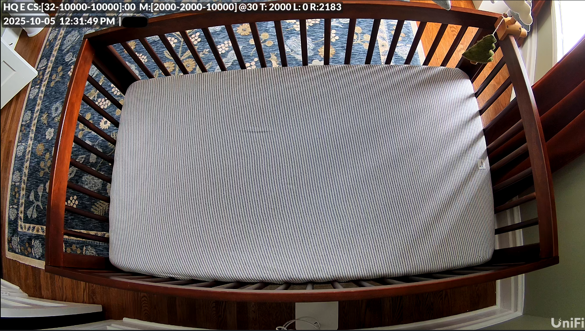
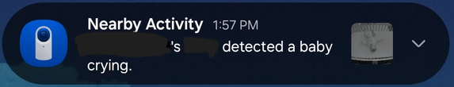

---
layout: post
title: Can you use a UniFi Camera as a Baby Monitor?
image: /assets/img/blog/crib_crop.jpg
description: >
  A post about me trying to justify my purchase to internet strangers
tags: [tips, personal, parenting, ubiquiti]
---

Our nursery, with the baby monitor seen at the top middle.
{:.figcaption}

- Table of Contents
{:toc}

To my surprise, I didn't see much information online about using a UniFi camera as a baby monitor when prepping the nursery for our first child. Maybe because the "Baby Crying" alert was new at the time, or maybe using a UniFi camera for as a baby monitor was just a bad idea. I set to figure that out for myself with some unnecessarily strict requirements:

1. No subscription
2. Recordings not stored on the Cloud
3. Hardwired (no Wi-Fi)
4. Can be moved to other rooms
5. Remotely accessible
6. Crying baby alerts

...and wouldn't it be cool if I could use my existing homelab setup?

## What I already had

1. A [UniFi Dream Machine Pro Max](https://store.ui.com/us/en/products/udm-pro-max), which I use as my router AND camera recording storage, sitting in my server rack. It comes with two hard drive slots, and I already purchased enough storage for months of camera footage from the various cameras in and around my house. I bought this before UniFi came out with their dedicated [Network Video Recorder](https://store.ui.com/us/en/products/unvr), and I don't regret it. I needed a router, did my research, and landed on a UniFi router anyway. Two birds, one stone.
2. Multiple ethernet ports in each room (maybe a story for a future blog post) which are eventually connected to a UniFi switch that is PoE-capable (Power over Ethernet).
3. Smart phones and multiple smart tablets.

## The Solution

A UniFi G5 Flex camera, on a camera stand, powered via PoE.
{:.tldr}

The camera's view
{:.figcaption}

I wasn't originally going to go with a UniFi camera, but I noticed that UniFi's Alert manager had a new option for "Baby Crying." This gave me the idea of at least trying a UniFi camera, *but which one*? Well, the [UniFi G5 Flex](https://store.ui.com/us/en/products/uvc-g5-flex) seemed to be the one most recommended for its "enhanced" AI detection capabilities (even compared to the G4 Flex). I didn't need an outdoor camera, or any of the other more expensive features. I bought the G5 Flex and tried out how well it could detect a crying baby and how the alerts would work. 

Technically, since I bought this camera before our kid was born, I set up the camera with the "Baby Crying" alert next to a phone playing a baby crying noise 🙃. And to my surprise (based on other user reviews), it worked reliably.

I looked around online and landed on this [floor stand](https://www.amazon.com/dp/B0D1VGKTMV) for the baby monitor. I opted not to mount the camera to the wall or ceiling as I may want to move around the nursery configuration in the future, and I like the flexibility of being able to move the baby monitor to an entirely different room. I just need to plug it into a wall jack that has PoE in any room of my house and we have a functional baby monitor.

Finally, I used an old Android tablet [Samsung Galaxy Tab A9+ 11](https://www.ebay.com/itm/126412297255) on which I installed the UniFi Protect app and have that on a bedside table as a baby monitor overnight. Some drawbacks:

- Missing common baby monitor features like CO2 detection, breathing monitor, etc. 
- This tablet is quite bright at night, even on its lowest brightness setting
- The tablet's live view has cut out a few times overnight due to Android updates or the UniFi app updating

### What it cost me

Breakdown of how much this cost (not including things I already had):

- [UniFi G5 Flex](https://store.ui.com/us/en/products/uvc-g5-flex): $129
- [Floor stand](https://www.amazon.com/dp/B0D1VGKTMV): $26
- [Ethernet cable](https://www.amazon.com/dp/B00016W6UU): $6

$161 to get a solution that fits all of my requirements:

1. No subscription 
2. Recordings are stored locally on my UniFi NVR for months
3. Ethernet handles power and data, no Wi-Fi involved (PoE)
4. Camera can be moved to other rooms
5. UniFi Protect can be accessed remotely, even outside your internal network
6. Crying baby alerts fire reliably through UniFi Protect (although we can hear kiddo even without a mobile alert). This works across multiple devices simultaneously, which is useful for when someone else is babysitting.  

...and I get to view the baby monitor where I already view all my other security cameras, no additional storage required.

## Overengineering

Using a UniFi camera as a baby monitor would, by most, be considered an overengineered solution to a problem that's already been solved by many cheaper, simpler solutions. But those solutions didn't meet my requirements (above). See a few examples below, taken from the [best sellers](https://www.amazon.com/gp/bestsellers/baby-products/21556916011) list on Amazon as of writing this post. I've included references to my requirements, numbered next to each item.

1. [HelloBaby HB6550](https://www.amazon.com/Monitor-5Display-Pan-Tilt-Zoom-Temperature-Lullabies/dp/B09GM8JZM9): Not remotely accessible (5), can only be viewed on the included screen (6)
2. [Kasa EC70](https://www.amazon.com/Kasa-Smart-Home-Security-Camera/dp/B08GHX9G5L): Subscription (1), Cloud Storage (2), Wi-Fi (3)
3. [Tapo C100](https://www.amazon.com/Tapo-security-indoor-pet-camera/dp/B0866S3D82): Subscription (1), Cloud Storage (2), Wi-Fi (3)
4. [VTech VM819](https://www.amazon.com/VTech-VM819-Monitor-Temperature-Lullabies/dp/B08V8RWP3W): Not remotely accessible (5), can only be viewed on the included screen (6)
5. [Tapo C210P2](https://www.amazon.com/indoor-dog-wifi-cameras-tapo/dp/B09Y8C185M)[^1]: Subscription (1), Cloud Storage (2), Wi-Fi (3) 

[^1]: Full disclosure, I did end up getting option 5, the [Tapo C210P2](https://www.amazon.com/indoor-pet-wifi-camera-tapo/dp/B09Y8TLP25), for $20 for travel with the kiddo, since I don't have my homelab with me when I travel. Paired it with an existing SD card I had from my Nintendo Switch 1 (...since the Switch 2 requires microSD express) for local storage and an [adjustable arm clamp](https://www.amazon.com/dp/B0DQD9SSCJ) to go with it.

## Parting Thoughts

When I asked my wife if she liked this setup, she said "yeah."

My favorite part about this setup is that I can continue to use the camera, tablet, etc. even after we no longer need a baby monitor. These are not single purpose devices, and I'm sure we'll find a use for them beyond this phase of our lives.

Good luck out there, or as kiddo would say "AAH OOH AAH" 👶.

## Related Links

- [Reddit - G4 Instant as baby camera](https://www.reddit.com/r/Ubiquiti/comments/1anijoz/g4_instant_as_baby_camera/)
- [Reddit - The “baby crying” alert isn’t as useful as I though](https://www.reddit.com/r/Ubiquiti/comments/1agnhj6/the_baby_crying_alert_isnt_as_useful_as_i_though/)
- [UniFi Alarm Manager](https://help.ui.com/hc/en-us/articles/27721287753239-UniFi-Alarm-Manager-Customize-Alerts-Integrations-and-Automations-Across-UniFi)